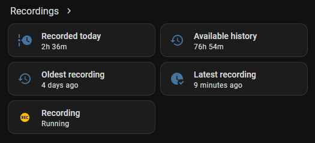

<p align="center">
  
</p>

# TVT Archive for Home Assistant

TVT Archive adds a **Recordings** panel to Home Assistant for browsing, playing, and exporting recordings stored on a TVT camera's built-in SD card.

It has two parts:

- a small Docker bridge that talks to the camera archive on your local network;
- a Home Assistant custom integration that provides the UI and proxies playback and downloads.

Live view is deliberately independent. You can map any existing Home Assistant `camera.*` entity from ONVIF, Generic Camera, go2rtc, Frigate, or another integration.

> [!IMPORTANT]
> TVT Archive is an experimental public release. Native TCP/9008 playback is verified on a TVT TD-C12. Other cameras and hardware need broader testing.

## Features

- Browse recordings directly from the camera's built-in SD card.
- Recording calendar and 24/12/6-hour timelines.
- Recorded playback with pause, rewind, seek, audio, and smooth adaptive buffering.
- **Original**, **Balanced (720p)**, and **Data Saver (480p)** qualities.
- Original-quality MP4 exports with real progress.
- Multiple configured cameras with separate timelines and sessions.
- Named live profiles using existing Home Assistant camera entities.
- Automatic hardware-acceleration probing with software fallback.
- Local bridge authentication with a generated access token.

## Recordings panel


# Installation

## 1. Start the Docker bridge

Clone the repository and inspect the Compose files before running them:

```bash
git clone https://github.com/mhndt/tvt-archive.git
cd tvt-archive
cp .env.example .env
```

The Compose files are kept together here:

- [Base / CPU setup](compose/compose.yaml)
- [Intel and AMD VAAPI override](compose/intel-amd.yaml)
- [NVIDIA override](compose/nvidia.yaml)
- [Local source-build override](compose/build-local.yaml) — development only

The base Compose file defines the container. Choose at most one hardware override. Docker merges the selected files into one container configuration; it does not create multiple TVT Archive containers.

### CPU-only

Leave this in `.env`:

```text
COMPOSE_FILE=compose/compose.yaml
```

Then start the bridge:

```bash
docker compose up -d
```

### Intel or AMD GPU

Find the group IDs for the render and video devices:

```bash
stat -c 'render GID=%g' /dev/dri/renderD128
stat -c 'video GID=%g' /dev/dri/card0
```

Put those values into `TVT_ARCHIVE_RENDER_GID` and `TVT_ARCHIVE_VIDEO_GID` in `.env`, then set:

```text
COMPOSE_FILE=compose/compose.yaml:compose/intel-amd.yaml
```

Start the bridge:

```bash
docker compose up -d
```

### NVIDIA GPU

Install NVIDIA Container Toolkit on the Docker host, then set this in `.env`:

```text
COMPOSE_FILE=compose/compose.yaml:compose/nvidia.yaml
```

Start the bridge:

```bash
docker compose up -d
```

The bridge tests complete decode, resize, and encode pipelines. A GPU path is selected only when the actual pipeline works; otherwise it falls back to another working path or software H.264.

### Get the bridge URL and token

The bridge URL is the Docker host's LAN address on port `8099`:

```text
http://<docker-host-lan-ip>:8099
```

Print the generated bridge token:

```bash
docker exec tvt-archive /opt/tvt-archive/entrypoint.sh show-token
```

Check the selected playback accelerator:

```bash
docker exec tvt-archive /opt/tvt-archive/entrypoint.sh accelerator-info
```

### Optional setup script

The manual Compose method above is recommended because every setting stays visible. The optional [script](setup.sh) performs the same steps and prints the bridge URL and token:

```bash
chmod +x setup.sh
./setup.sh
```

## 2. Install the Home Assistant integration

### Through HACS as a custom repository

[](https://my.home-assistant.io/redirect/hacs_repository/?owner=mhndt&repository=tvt-archive&category=integration)

Until TVT Archive is available in the default HACS catalog:

1. Open **HACS**.
2. Open its menu and choose **Custom repositories**.
3. Add `https://github.com/mhndt/tvt-archive` as an **Integration**.
4. Install **TVT Archive**.
5. Restart Home Assistant.

### Manually

Copy `custom_components/tvt_archive` into:

```text
/config/custom_components/tvt_archive
```

Restart Home Assistant.

## 3. Connect Home Assistant to the bridge

1. Open **Settings → Devices & services**.
2. Select **Add integration**.
3. Search for **TVT Archive**.
4. Enter the bridge URL and bridge token from the previous step.

## 4. Add camera credentials

**Camera credentials do not go in Docker Compose or `.env`.**

After Home Assistant connects to the bridge, the TVT Archive setup flow asks for:

- a camera name;
- the camera or recorder's local IP address or hostname;
- the camera's own local username and password;
- the archive backend, normally **Native TCP/9008**;
- recording-audio handling for Native TCP/9008: **Auto** (recommended), **Always expect audio**, or **Disabled**;
- optionally, an existing Home Assistant camera entity for Live view.

The setup flow sends the camera details to the bridge, which stores them in the `tvt-archive-config` Docker volume. Home Assistant keeps the bridge URL and token in its config entry.

The integration automatically adds **Recordings** to the Home Assistant sidebar. No Lovelace card, YAML, or frontend resource is required.

### Add, edit, or remove cameras later

Open **Settings → Devices & services**, find **TVT Archive**, and select **Configure**. The management menu provides:

- **Add camera** — connect another camera or recorder and optionally assign its first Live profile.
- **Edit camera** — change its name, address, recording mode, recording-audio handling, port, username, or password. Leave the password blank to keep the current password.
- **Manage live profiles** — add profiles, rename or reorder them, choose a different existing Home Assistant camera entity, set the default profile, or remove a profile.
- **Remove camera** — remove it from TVT Archive. This does not delete recordings from the camera or recorder.

TVT Archive reloads the integration after a saved change so the panel and generated entities reflect the current camera list.

### Entities created in Home Assistant



# Using TVT Archive

Choose a camera, date, recording quality, and timeline width. Green sections contain recordings. Click a recorded section, then select **Play from here** or choose a range and prepare an MP4 export.

## Recording qualities

- **Original** — source resolution for playback. Original downloads copy the stored H.264 video and convert recorded G.711 audio to AAC when audio is present.
- **Balanced (720p)** — 1280×720 H.264.
- **Data Saver (480p)** — 854×480 H.264.

Original browser playback uses short keyframe intervals for smooth one-second fragments. Original downloads still retain stream-copy video.

## Live profiles

TVT Archive does not create or replace live camera entities. Each live profile is simply a friendly name mapped to an existing Home Assistant `camera.*` entity.

```text
Main          → camera.front_door_main
Mobile        → camera.front_door_sub
Night vision  → camera.front_door_night
```

Those names are only examples. The source can be ONVIF, Generic Camera, go2rtc, Frigate, or another integration, and live profiles do not affect recorded-playback quality.

# Compatibility

| Verified setup |
|---|
| TVT TD-C12 using Native TCP/9008 on an Intel HD Graphics 530 iGPU with Debian Trixie FFmpeg 7.1.5, libva 2.22.0, and Intel iHD 25.2.3 |

**Recording audio:** Auto learns positive archive-audio capability separately for each camera. For an unknown camera, startup uses the recording's own video timestamps during the existing timing window instead of assuming wall-clock delivery is real time. If audio appears later, that positive capability is remembered for future playback. Always expect audio provisions the browser audio track immediately; Disabled forces video-only playback.

# Updating

Change into the directory where you cloned TVT Archive, then update the checkout and container:

```bash
git pull
docker compose pull
docker compose up -d
```

HACS updates the Home Assistant integration separately. Restart Home Assistant when HACS requests it.

# How it works

```text
Home Assistant Recordings panel
        │ authenticated, signed local proxy URLs
        ▼
TVT Archive Docker bridge
        │
        ├── TCP/9008 metadata: dates and recording timeline
        ├── TCP/9008 media: stored H.264 and G.711 audio
        └── recorded RTSP fallback: H.264, commonly video-only
                │
                ▼
FFmpeg → short-fragment HLS/fMP4 playback or MP4 export
```

The bridge talks directly to the camera on the LAN. It asks for the dates that contain recordings, searches a selected time window for exact recorded ranges, and then requests the chosen historical interval. The camera returns interleaved raw video, audio, and media timestamps from its SD-card archive. Home Assistant proxies the resulting playlists, fragments, and completed downloads to the Recordings panel.

## Why native TCP/9008?

The first implementation used recorded RTSP. It could retrieve stored H.264 video from the tested camera, but recorded audio was not usable and authentication behavior varied. RTSP remains available as a fallback.

A later prototype used the vendor's Linux SDK. It proved the SD archive contained H.264 video and G.711 A-law audio, but it also tied the project to a platform-specific vendor library and made deployment harder, so that approach was retired.

Network analysis of NVMS showed one TCP connection to port `9008` carrying login, metadata, video, audio, and playback continuation. TVT Archive implements the archive operations it needs directly, without requiring NVMS or the older SDK at runtime.

More technical detail is available in:

- [Reverse-engineering history](docs/REVERSE_ENGINEERING.md)
- [Native TCP/9008 archive protocol](docs/NATIVE_9008_PROTOCOL.md)
- [Media pipeline](docs/MEDIA_PIPELINE.md)
- [GPU pipeline notes](docs/GPU.md)

# Security and license

- Keep ports `8099`, `9008`, and `554` on a trusted LAN or private VPN rather than exposing them directly to the Internet.
- Protect the bridge token, camera password, and Docker config volume like any other local service credentials.
- Remove sensitive details from logs before posting them publicly.

TVT Archive is released under the [MIT License](LICENSE). Third-party components and their licenses are listed in [THIRD_PARTY.md](THIRD_PARTY.md).

TVT Archive is an unofficial community project. Product names and trademarks belong to their respective owners.
