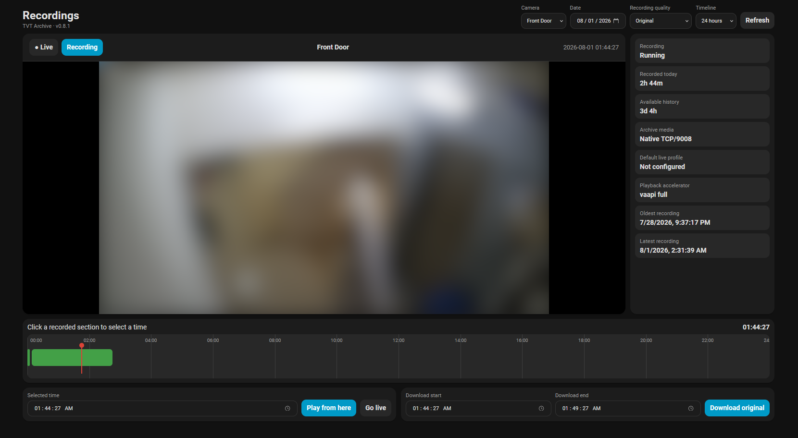

<p align="center">
  
</p>

# TVT Archive for Home Assistant

TVT Archive adds a **Recordings** panel to Home Assistant for browsing, playing, and exporting recordings stored on compatible TVT and TVT-protocol cameras or recorders.

It has two parts:

- a small Docker bridge that talks to the camera archive on your local network;
- a Home Assistant custom integration that provides the UI and proxies playback and downloads.

TVT Archive is also intended as an alternative to the vendor P2P/cloud access commonly used by **SuperLive Plus**. When used locally, archive access stays between Home Assistant, the TVT Archive bridge, and the camera or recorder on your LAN, without depending on the vendor's external P2P infrastructure.

TVT Archive intentionally handles recordings only. Configure live viewing separately in Home Assistant using any camera integration or dashboard card you prefer.

> [!IMPORTANT]
> TVT Archive is an experimental public release. Native TCP/9008 playback is verified on a TVT TD-C12. Other TVT devices and OEM/rebranded devices that implement TVT's protocol may be compatible, but they have not yet been verified.

## Features

- Browse recordings directly from the camera's built-in SD card.
- Recording calendar and 24/12/6-hour timelines.
- Playback with pause, rewind, seek, audio, and adaptive buffering.
- **Original**, **Balanced (720p)**, and **Data Saver (480p)** playback.
- MP4 exports.
- Multiple configured cameras.
- Automatic hardware-acceleration probing with software fallback.
- Local bridge authentication with a generated access token.

## Recordings panel



# Installation

TVT Archive has two parts:

1. The Docker bridge
2. The Home Assistant integration

The bridge can run on any machine on your LAN with Docker and Docker Compose v2.

## 1. Start the Docker bridge

Clone the repository and run the setup script:

```bash
git clone https://github.com/mhndt/tvt-archive.git
cd tvt-archive
chmod +x setup.sh
./setup.sh
```

You can clone TVT Archive wherever you prefer. Persistent data is stored in Docker named volumes.

The setup script detects supported hardware acceleration, starts the bridge, and prints the **Bridge URL** and **Access token** you will need in Home Assistant.

<details>
<summary><strong>Manual Docker Compose setup</strong></summary>

If you prefer to configure the container manually:

```bash
cp .env.example .env
```

The available Compose files are:

- [Base / CPU setup](compose/compose.yaml)
- [Intel and AMD VAAPI override](compose/intel-amd.yaml)
- [NVIDIA override](compose/nvidia.yaml)
- [Local source-build override](compose/build-local.yaml) — development only

### CPU-only

Leave this in `.env`:

```text
COMPOSE_FILE=compose/compose.yaml
```

Then:

```bash
docker compose up -d
```

### Intel or AMD GPU

Find the render and video group IDs:

```bash
stat -c 'render GID=%g' /dev/dri/renderD128
stat -c 'video GID=%g' /dev/dri/card0
```

Put those values into `TVT_ARCHIVE_RENDER_GID` and `TVT_ARCHIVE_VIDEO_GID` in `.env`, then set:

```text
COMPOSE_FILE=compose/compose.yaml:compose/intel-amd.yaml
```

Start the bridge:

```bash
docker compose up -d
```

### NVIDIA GPU

Install NVIDIA Container Toolkit, then set:

```text
COMPOSE_FILE=compose/compose.yaml:compose/nvidia.yaml
```

Start the bridge:

```bash
docker compose up -d
```

The bridge tests the available decode, resize, and encode pipeline and falls back to software H.264 if a hardware path is unavailable.

### Bridge URL and token

The bridge URL is:

```text
http://<docker-host-lan-ip>:8099
```

Print the generated token:

```bash
docker exec tvt-archive /opt/tvt-archive/entrypoint.sh show-token
```

Check the selected accelerator:

```bash
docker exec tvt-archive /opt/tvt-archive/entrypoint.sh accelerator-info
```

</details>

## 2. Install the Home Assistant integration

### Through HACS as a custom repository

[](https://my.home-assistant.io/redirect/hacs_repository/?owner=mhndt&repository=tvt-archive&category=integration)

Until TVT Archive is available in the default HACS catalog:

1. Open **HACS**.
2. Open its menu and choose **Custom repositories**.
3. Add `https://github.com/mhndt/tvt-archive` as an **Integration**.
4. Install **TVT Archive**.
5. Restart Home Assistant.

### Manually

Copy `custom_components/tvt_archive` into:

```text
/config/custom_components/tvt_archive
```

Restart Home Assistant.

## 3. Connect Home Assistant to the bridge

Open:

**Settings → Devices & services → Add integration → TVT Archive**

Enter the **Bridge URL** and **Access token** printed by the setup script.

## 4. Add camera credentials

The setup flow asks for:

- camera name;
- local IP address or hostname;
- local username and password;
- archive backend, normally **Native TCP/9008**;
- recording-audio mode.

Camera credentials are stored by the bridge and do not need to be placed in Docker Compose or `.env`.

The integration automatically adds **Recordings** to the Home Assistant sidebar.

You can add, edit, or remove cameras later from **Settings → Devices & services → TVT Archive → Configure**.

# Using TVT Archive

Choose a camera, date, recording quality, and timeline width. Green sections contain recordings.

Select a recorded section to play from that point, or choose a range to export it as an MP4.

## Recording qualities

- **Original** — source resolution.
- **Balanced (720p)** — 1280×720 H.264.
- **Data Saver (480p)** — 854×480 H.264.

Original-quality exports keep the stored H.264 video and convert recorded audio when needed for MP4 compatibility.

# Compatibility

| Status | Device / protocol |
|---|---|
| **Verified** | TVT TD-C12 — Native TCP/9008 |
| **Potentially compatible** | Other TVT cameras, NVRs, DVRs, and OEM/rebranded devices implementing TVT's TCP/9008 protocol |

Potential compatibility is not the same as verified support.

NVMS can communicate with devices through several mechanisms, so a third-party camera that works in NVMS only through ONVIF, RTSP, or a vendor SDK is not necessarily compatible with TVT Archive.

Compatibility reports for additional TVT-protocol devices are welcome.

# Updating

From the directory where TVT Archive was cloned:

```bash
git pull
docker compose pull
docker compose up -d
```

HACS updates the Home Assistant integration separately. Restart Home Assistant when requested.

# How it works

```text
Home Assistant Recordings panel
        │
        ▼
TVT Archive Docker bridge
        │
        ├── TCP/9008 metadata
        ├── TCP/9008 recorded video/audio
        └── recorded RTSP fallback
                │
                ▼
             Camera
```

The bridge talks directly to the camera on the LAN. It retrieves recording dates and timeline metadata, requests the selected historical interval, then prepares the resulting video and audio for browser playback or MP4 export.

## Why native TCP/9008?

The first implementation used recorded RTSP. It could retrieve stored video from the tested camera, but recorded audio was not usable and authentication behavior varied.

A later prototype used the vendor's Linux SDK, which confirmed that the SD-card archive contained H.264 video and G.711 audio, but depending on a platform-specific vendor library made deployment harder.

Network analysis of NVMS communicating with the tested TVT TD-C12 showed a TCP connection to port `9008` carrying login, metadata, video, audio, and playback control. TVT Archive reimplements the archive/playback subset of that private protocol without requiring NVMS or the older SDK at runtime.

More technical detail:

- [Reverse-engineering history](docs/REVERSE_ENGINEERING.md)
- [Native TCP/9008 archive protocol](docs/NATIVE_9008_PROTOCOL.md)
- [Media pipeline](docs/MEDIA_PIPELINE.md)
- [GPU pipeline notes](docs/GPU.md)

# Security and license

- Keep ports `8099`, `9008`, and `554` on a trusted LAN or private VPN rather than exposing them directly to the Internet.
- Protect the bridge token, camera password, and Docker config volume like any other local service credentials.
- Remove sensitive details from logs before posting them publicly.

TVT Archive is released under the [MIT License](LICENSE). Third-party components and their licenses are listed in [THIRD_PARTY.md](THIRD_PARTY.md).

TVT Archive is an unofficial community project. Product names and trademarks belong to their respective owners.
